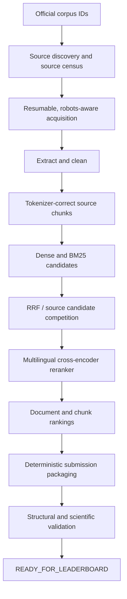

# ViBioMIR Retrieval

ViBioMIR Retrieval is a multilingual biomedical information-retrieval project
built for a competition with Vietnamese medical queries and an organizer-owned
corpus identifier space. The system retrieves both official document IDs and
verbatim, source-derived text chunks from Vietnamese-, Chinese-, and
English-associated sources. Organizer evaluation reports document and chunk
precision, recall, and recall-weighted F2 metrics.

> [!IMPORTANT]
> ## Current status — Phase 10E: Focused Corpus Scaling
>
> Organizer-confirmed scaling now shows both depth effects and substantial
> source-density differences:
>
> | Checkpoint | Searchable documents | Organizer FINAL |
> |---|---:|---:|
> | Shallow G5A | about 300 | `0.0009` |
> | Corrected G5A depth1000 | 2,997 | `0.0037` |
> | Corrected G1A depth1000 | 2,005 | `0.0062` |
> | Corrected G6B depth1000 | 2,910 | `0.0045` |
> | Phase 10E G5A 11.2K | 11,200 | `0.0085` |
> | Phase 10E G1A 10K | 10,010 | `0.0234` |
> | Phase 10E G6B 15K | 15,000 official IDs / 14,908 usable | `0.0140` |
> | Phase 10E G1A 10K + G6B 15K | 25,010 official IDs / 24,909 usable | `0.0332` |
> | Phase 10E full nine-source union | 36,210 official IDs / 36,109 usable | `0.0383` |
>
> G1A scaled to **10,010 official documents / 131,166 chunks** and reached
> organizer FINAL `0.0234`, up from corrected depth1000 FINAL `0.0062`.
> This is strong organizer-confirmed depth scaling, not evidence that future
> scaling will remain linear or that G1A contains most gold documents.
>
> G6B independently scaled from corrected depth1000 FINAL `0.0045` to `0.0140`
> at 15,000 official IDs. Their zero-acquisition union reached organizer FINAL
> `0.0332`, confirming complementary signal beyond G1A alone. The nine-source
> union adding organizer-valid G5A 11.2K reached organizer FINAL `0.0383`.
> Three no-acquisition leave-out/resurrection probes are now scientifically
> validated and ready as the final information tests before quota reset.

## Current ready submissions

Submission selection is evidence-based; **never select a ZIP by filename
guessing**. The authoritative operational sources are:

- [Submission instructions and current upload list](submissions/README.md)
- [Submission registry](submissions/MANIFEST.csv)
- [`submissions/00_READY_TO_UPLOAD/`](submissions/00_READY_TO_UPLOAD/)

The three current upload candidates are the full union minus Medlatec, the full
union minus Suckhoedoisong, and the full union plus the shallow Round-3
resurrection sources. Consult the registry for canonical paths and hashes.

Organizer-valid G5A 11.2K, G1A 10K, G6B 15K, and corrected depth1000 packages
are archived as `SUBMITTED_VALID`. Consult the registry for the exact current
upload candidate; ZIP existence alone is not readiness evidence.

> [!CAUTION]
> **NEVER upload anything from
> [`submissions/90_INVALID_DO_NOT_SUBMIT/`](submissions/90_INVALID_DO_NOT_SUBMIT/).**
> This folder includes the original corrupted depth-1000 packages retained as
> historical evidence.

## Problem and evaluation

- The official query set contains **1,200 unique Vietnamese biomedical
  queries**.
- The official corpus metadata contains **4,394,718 document IDs across 97
  domains**. A returned document ID must belong to that official identifier
  space.
- Source pages are multilingual. Observed and domain-associated material spans
  Vietnamese, Chinese, and English.
- A submission is a ZIP containing one root-level UTF-8 JSON file with exactly
  1,200 query objects. Each object contains an integer query `id`, integer
  `relevant_docs`, and `relevant_chunks` with `doc_id` and `chunk_text`.
- Chunk text must be contiguous, source-derived text. It is never generated,
  translated, summarized, or approximately reconstructed for submission.
- The organizer reports document and chunk precision, recall, and macro F2.
  F2 weights recall more heavily than precision.

See [Submission Generation](docs/SUBMISSION_GENERATION.md) for the detailed
schema and validation contract.

## System overview



The established retrieval stack uses BGE-M3 dense embeddings, BM25 sparse
retrieval, deterministic Reciprocal Rank Fusion, and
`BAAI/bge-reranker-v2-m3`. Phase 10E changes **corpus depth** while keeping the
query set, control corpus, retrieval policy, model revisions, ranking policy,
top-k policy, provenance rules, and deterministic tie-breaking fixed.

## Experiment phases

This table is a map, not the full research record. Follow the links below for
the evidence and detailed results.

| Phase | Purpose | Status / durable conclusion |
|---|---|---|
| 0 | Project harness | Existed before visible Git history; exact date and commit are unknown. |
| 1 | Dataset understanding | Complete. Established 1,200 queries, 4.39M URLs, 97 domains, and strong domain concentration. |
| 2A–2C | Crawler, source probing, production readiness | Complete. Built resumable, robots-aware acquisition and bounded throughput evidence; no unrestricted crawl was started. |
| 3 | Extraction, cleaning, chunking | Complete. Produced provenance-preserving documents and deterministic chunks. |
| 4 | Dense baseline | Complete. BGE-M3 and exact FAISS `IndexFlatIP` over the pilot corpus. |
| 6 | Sparse and hybrid baseline | Complete. Added multilingual BM25 and deterministic RRF. Phase 5 remained deferred because no trustworthy local labels existed. |
| 7 | Reranking and candidate selection | Complete. Added the pinned multilingual reranker and crash-safe SQLite score checkpoints. |
| 8 / 8C | Full-corpus capacity and URL-only reduction | Complete. Exhaustive local production exceeded laptop resources; URL-only query-conditioned reduction was not viable. |
| 9 | Valid submission generation | Complete. Produced deterministic, provenance-checked organizer packages. |
| 10A | Leaderboard calibration | Complete. More result depth alone did not repair recall; expanded source context helped chunk precision. |
| 10B | Search discovery, acquisition benchmark, source probe | Complete. Public/site search was insufficient; bounded source acquisition exposed strong domain differences. |
| 10C | S4 targeting and source scaling | Complete. Metadata targeting failed, while broad S4 scaling from 1K to 5K improved organizer FINAL from `0.0004` to `0.0014`. |
| 10D | Adaptive source census and depth testing | Complete for current checkpoints. Group tests isolated priority trios; corrected G5A depth1000 showed positive scaling. |
| 10E | Focused corpus scaling | Active. G5A 11.2K reached organizer FINAL `0.0085`, G1A 10K reached `0.0234`, and G6B 15K reached `0.0140`. The next test combines G1A and G6B without new acquisition. |

Detailed history:

- [Experiment Journal](docs/EXPERIMENT_JOURNAL.md)
- [Direction-changing Timeline](docs/TIMELINE.md)
- [Organizer Leaderboard History](docs/leaderboard_history.csv)

## Important scientific findings

- **URL metadata is not a safe content proxy.** Query-conditioned URL/path
  reduction substantially damaged retention against existing content-retrieval
  candidates and was rejected.
- **Returning more results did not solve the coverage problem.** Phase 10A
  depth variants did not improve displayed recall.
- **Source choice matters.** Sources with similar acquisition sizes produced
  very different organizer signals. Local ranking movement alone did not
  predict that signal.
- **Scaling behavior is source-dependent.** S2/FamilyDoctor showed low marginal
  value at 5K under the fixed pipeline, while S4 improved and corrected G5A
  improved from `0.0009` to `0.0037`.
- **G5A has one confirmed positive depth interval, not a guaranteed curve.**
  G5A continued from corrected `0.0037` to `0.0085`, but the project still
  measures each checkpoint rather than assuming linear gains.
- **Per-document yield differs sharply.** Corrected G1A reached `0.0062` with
  2,005 usable documents, making it the highest-yield tested priority trio per
  document so far; this is not a claim of global superiority.
- **G1A has now shown strong positive depth scaling.** Its organizer FINAL rose
  from corrected depth1000 `0.0062` to `0.0234` at 10,010 official documents,
  while every reported precision/recall metric also increased. Later depth
  checkpoints still require independent organizer confirmation.
- **G6B also scales positively.** Its organizer FINAL rose from corrected
  depth1000 `0.0045` to `0.0140` at 15,000 official IDs. Whether its signal is
  complementary to G1A remains an unanswered organizer-level question.
- **Document count is not content volume.** At Phase 10E, the three G5A sources
  have materially different chunks per document: 1,200/18,726, 5,000/14,894,
  and 5,000/59,148 documents/chunks respectively.

## Important failures and lessons

### Ambiguous SQLite cache seeding

An ambiguously correlated SQL subquery copied one old score into all 86,400
depth-1000 destination rows. Row counts and SQLite integrity still looked
correct. The three resulting organizer runs are scientifically invalid and are
quarantined. Cache reuse now requires an explicitly aliased exact
`(query_id, chunk_id)` match, value auditing, score-distribution sanity, and a
control replay.

### Package host-memory exhaustion

Materializing text-heavy candidate tables exhausted the laptop's host memory.
Ranking and packaging now use bounded streaming/finalization paths rather than
loading every candidate text row at once.

### Missing Phase 10E calibration dependency

Phase 10E initially omitted the inherited `inputs.c1_candidate_pool` contract
and failed only after expensive acquisition and chunking. Recovery reused the
persisted Phase 10D calibration (`m=8`). The lesson is to validate inherited
configuration dependencies before expensive stages begin.

### FP16 batch-shape equivalence

The reranker startup gate initially treated a maximum score difference of
`0.005859375` as model drift. Investigation found an identical model/input
contract, zero same-process and fresh-process variation, exact reproduction in
the original batch-of-two context, and unchanged ordering. The difference came
from FP16 dynamic-padding batch shape. The gate now requires an exact semantic
contract and stable ordering, with only an empirically measured numerical
envelope.

See the [Experiment Journal](docs/EXPERIMENT_JOURNAL.md) for incident details
and evidence paths.

## Scientific safety rules

- A submission is not eligible for upload unless its scientific state is
  `READY_FOR_LEADERBOARD` and the registry marks its package
  `READY_TO_SUBMIT`.
- ZIP existence and structural validity alone do not establish a valid
  experiment.
- Preserve the declared experimental variable and verify that every other
  contract field remains fixed.
- Reuse reranker scores only by exact `(query_id, chunk_id)` keys.
- Invalid organizer runs remain historical evidence but must never support
  scientific conclusions.
- After `NEEDS_AGENT`, inspect the incident bundle and durable checkpoints
  before resuming. Never blindly restart completed stages.
- During depth experiments, do not silently change retrieval, model, candidate,
  ranking, chunk, or top-k policies.
- The established reranker setting on this machine is CUDA FP16,
  `batch_size=2`, and `max_length=512`. Batch size 4 previously caused OOM and
  is not retried.
- Long-running acquisition and scoring retain a **20 GiB minimum free-disk
  floor**.
- Never bypass robots rules, CAPTCHAs, access controls, or anti-bot systems.

## Repository structure

```text
configs/       versioned experiment and pipeline configuration
src/           reusable acquisition, processing, retrieval, reranking, and validation code
tools/         supervised long-run workers, recovery tools, audits, and registry maintenance
scripts/       command-line entry scripts, including the PowerShell supervisor wrapper
tests/         offline and mocked regression tests
docs/          reports, scientific history, schema documentation, and decisions
data/          ignored raw and generated data, caches, embeddings, indexes, and checkpoints
artifacts/     compact reports plus ignored live-run and incident state
submissions/   lifecycle-organized ZIP packages and authoritative registry
```

Submission lifecycle folders are:

| Folder | Meaning |
|---|---|
| `00_READY_TO_UPLOAD/` | Audited current upload candidates |
| `10_SUBMITTED_VALID/` | Organizer-submitted valid history |
| `20_VALID_CONTROLS/` | Local replay/control packages; never upload by default |
| `30_SUPERSEDED_VALID/` | Valid but superseded historical variants |
| `90_INVALID_DO_NOT_SUBMIT/` | Invalid or explicit smoke packages |
| `99_REVIEW_REQUIRED/` | Insufficient evidence for a safe classification |

## Setup

The package metadata in [`pyproject.toml`](pyproject.toml) requires Python
3.11 or newer and defines all direct dependencies plus the `dev` test extra.
There is no separate lock file, so reproduce a historical run from its config,
recorded model revisions, and environment evidence rather than assuming that
future dependency resolution is byte-identical.

For a new Windows virtual environment:

```powershell
python -m venv .venv
.\.venv\Scripts\python.exe -m pip install -e ".[dev]"
```

Run the offline suite with the command used in this repository:

```powershell
.\.venv\Scripts\python.exe -m pytest -q
```

The current development environment is Python 3.12.10 with PyTorch
2.5.1+cu121 and Transformers 4.48.3. Do not upgrade this working model/runtime
stack in the middle of an experiment.

## Running and monitoring experiments

Long-running work is delegated to the local supervisor rather than kept alive
by an interactive agent. [`scripts/run_competition.ps1`](scripts/run_competition.ps1)
wraps [`tools/competition_supervisor.py`](tools/competition_supervisor.py) with
a run ID, a worker command, and the 20 GiB disk guard. Worker choice and config
are experiment-specific; do not substitute a stale command from another run.

Each run writes beneath `artifacts/runs/<run_id>/`:

- `state.json` — current stage, status, counts, and checkpoints
- `events.jsonl` — append-only execution events
- `metrics.json` — operational telemetry
- `manifest.json` — launch command and initial run contract
- `final_report.json` — terminal state
- `logs/worker.log` — worker output

Monitor a run without attaching destructively:

```powershell
Get-Content "artifacts/runs/<run_id>/state.json" -Raw
Get-Content "artifacts/runs/<run_id>/events.jsonl" -Wait
```

The supervisor uses these terminal states:

- `FAILED_SAFE` — a known safety guard, such as the disk floor, stopped work.
- `NEEDS_AGENT` — an unknown failure or integrity ambiguity requires diagnosis;
  inspect `artifacts/incidents/<timestamp>_<run_id>/` first.
- `WAITING_FOR_LEADERBOARD` — packages are complete and await organizer input,
  but the worker did not apply the newer scientific-ready state.
- `READY_FOR_LEADERBOARD` — structural and mandatory scientific gates passed.

While active, the Windows supervisor prevents system sleep without permanently
changing the machine's power plan. Runs use locks to avoid duplicate ownership
and preserve stage-specific checkpoints for safe recovery.

## Submission lifecycle

```text
generated / staging
        ↓
structurally + scientifically validated
        ↓
READY_TO_SUBMIT in MANIFEST.csv
        ↓
manual organizer upload
        ↓
SUBMITTED_VALID or historical quarantine/archive
```

[`submissions/MANIFEST.csv`](submissions/MANIFEST.csv) is authoritative for a
package's **current path**, lifecycle status, size, SHA-256, report, audit, and
known organizer metrics. Historical reports retain generation-time paths and
must not be used to locate the current upload file.

Registry integrity can be checked without regenerating submissions:

```powershell
.\.venv\Scripts\python.exe tools\submission_registry.py check
```

## Reproducibility

Reproducibility is enforced through:

- official and deterministic document/chunk identifiers;
- versioned YAML experiment contracts and pinned model revisions;
- exact source-text and chunk-to-document provenance;
- exact-key SQLite reranker caches with integrity and distribution audits;
- old/new/union corpus and candidate accounting;
- control replay for new execution paths;
- deterministic JSON/ZIP serialization and recorded SHA-256 hashes;
- offline regression tests; and
- a durable journal, timeline, leaderboard history, incident bundles, and run
  state.

Snapshot on 2026-10-09: the complete offline suite passed **164 tests** after
the submission-registry cleanup. This is a point-in-time result, not a promise
about future worktree changes.

## Documentation map

| Document | Purpose |
|---|---|
| [Experiment Journal](docs/EXPERIMENT_JOURNAL.md) | Detailed questions, changes, failures, lessons, decisions, costs, and evidence |
| [Timeline](docs/TIMELINE.md) | Compact chronological list of direction-changing milestones |
| [Leaderboard history](docs/leaderboard_history.csv) | Organizer-confirmed metrics, including explicitly invalid historical runs |
| [Submission operations](submissions/README.md) | Human upload instructions and current ready packages |
| [Submission manifest](submissions/MANIFEST.csv) | Machine-readable current paths, statuses, hashes, reports, and audits |
| [Task ledger](docs/TASKS.md) | Phase-by-phase implementation status |
| [Dataset report](docs/DATASET_REPORT.md) | Official query/corpus structure and measured distributions |
| [Full-corpus scaling](docs/FULL_CORPUS_SCALING.md) | Capacity model, storage limits, and production gates |

## Hardware notes

The current development laptop has an **NVIDIA GeForce RTX 3050 Laptop GPU
with 4 GiB VRAM**. The proven reranker configuration is:

- `BAAI/bge-reranker-v2-m3`
- CUDA FP16
- batch size 2
- maximum sequence length 512

These are constraints of the current reproducible environment, not general
minimum system requirements for the project.
